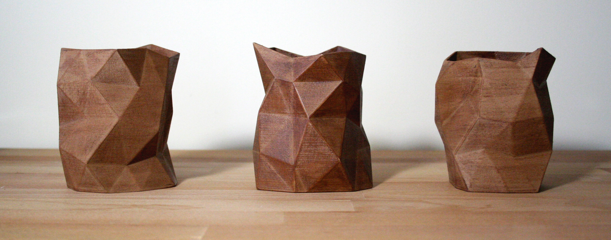

# Erratic vases

This little scripts allows to randomly generate vases that you can 3D print.

You will need any version of:
- NumPy
- numpy-stl

``` 
pip install numpy-stl
```

## Example: a triptych in wood filament

``` python
from vase_generator import Vase

height              = 100 #mm  
radius              =  40 #mm  
wall_thickness      =   2 #mm  
maximum_randomness  =  15 #mm  
number_points_z     =   5  
number_points_theta =  10  


vase = Vase(height, radius, number_points_z, number_points_theta, wall_thickness, maximum_randomness)  

vase.generate_random_vase('')  
vase.generate_random_vase('')  
vase.generate_random_vase('')  
```


<p align = "center">

</p>